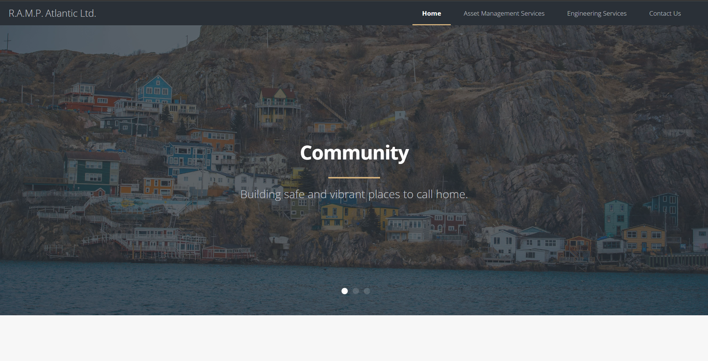
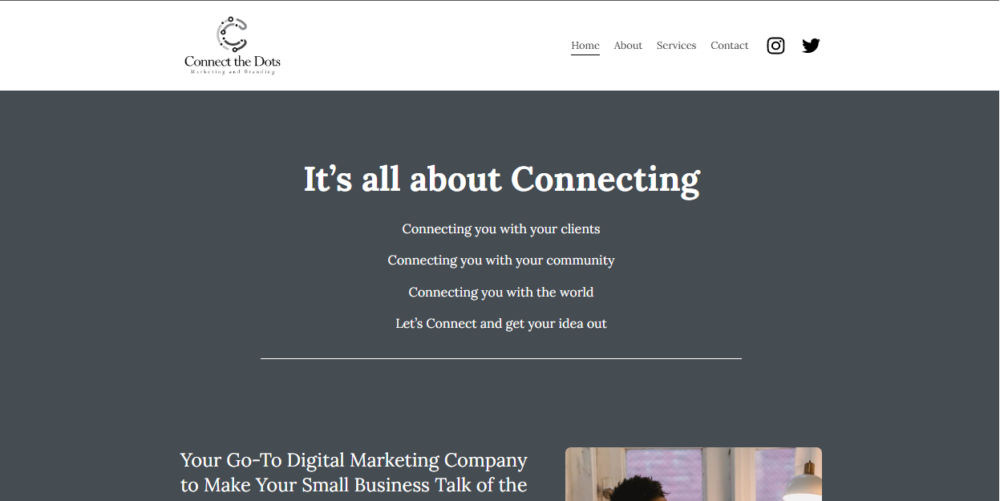
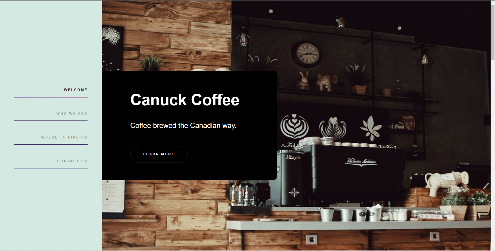
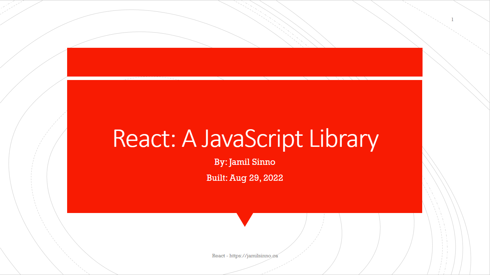
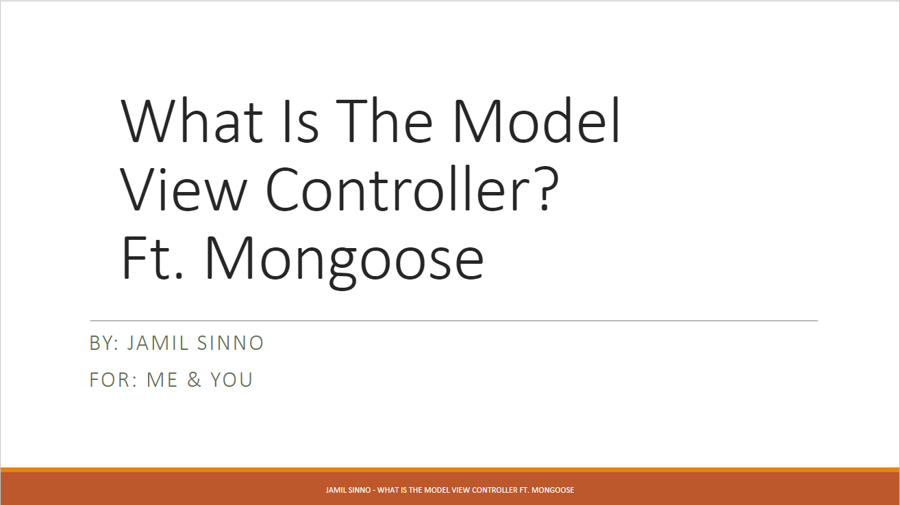
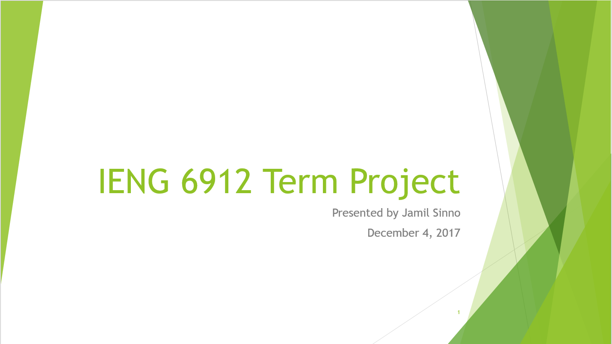

  
  
  
  
  

My name is Jamil Sinno. I am a Full-Stack Software Developer specializing in the MERN stack. My career vision is to educate, and advocate for accessibility and representation in tech.

I was born in Kuwait to Lebanese parents before immigrating to Halifax in 2004. Growing up as an immigrant in Canada came with a lot of challenges and opportunities that leave me well placed to advocate for and represent those with similar experiences.  With my background in Chemical and Industrial Engineering from Dalhousie University and a passion for writing code, I plan on bringing my expertise into the tech world. I believe there is a place for everyone in tech, and that technology can improve many people's lives, specifically marginalized groups.

When I'm not coding I'm usually gaming, lifting, cooking, reading, or posting about my experiences. I have two cats, Ed and Al. I post pictures of them frequently on my <a href="https://twitter.com/JamilSinno" target="_blank" rel="noopener noreferrer">Twitter</a>.

Want to know more about me or have a website or app developed for you? Visit me at my <a href="https://jamilsinno.ca">website.</a>

<a href="https://www.a11yproject.com/">#A11y project</a> advocate

<h3 align="left">Connect with me:</h3>

<h3 align="left">Languages and Tools:</h3>

        

<h1 align="center">Projects</h1>
<table bordercolor="#66b2b2">
  <tr>
    <td width="50%" valign="top">
      <h3 align="center">R.A.M.P. Atlantic Ltd.</h3>
         
        
         
        
 
          
        

        
HTML, CSS and JS - A website design to showcase R.A.M.P. Atlantic Ltd. website and services.

    </td>
    <td width="50%" valign="top">
      <h3 align="center">Connect the Dots Marketing and Branding</h3>
         
        
         
        
 
          
        

        
HTML, CSS and JS - A website design to showcase Connect The Dots Marketing and Branding's website.

    </td>
  </tr>
  
  <tr>
    <td width="50%" valign="top">
      <h3 align="center">Canuck Coffee</h3>
         
        
         
        

          
    
  
      

        
HTML, CSS and JS - Canuck coffee is a imaginary coffee shop in the heart of Toronto.

    </td>
    <td width="50%" valign="top">
      <h3 align="center">Steve's Gallery</h3>
         
        
         
        

          
    
  
      

        
HTML, CSS and JS - A website design to showcase Steve Johnson's work from Pexel

    </td>
  </tr>
</table>

<h1 align="center">Decks</h1>
<table bordercolor="#66b2b2">
  <tr>
    <td width="50%" valign="top">
      <h3 align="center">React: A JavaScript Library</h3>
         
        
         
        
 
          
        

        
Technologies used: React.js

        <h6>Tags: Education</h6>
    </td>
    <td width="50%" valign="top">
      <h3 align="center">What Is The Model View Controller? Ft. Mongoose</h3>
         
        
         
        
 
          
        

        
Technologies covered: MVC, Mongoose

        <h6>Tags: Education</h6>
    </td>
  </tr>
  <tr>
    <td width="50%" valign="top">
      <h3 align="center">Travelling App Industrial Engineering Master's Project</h3>
         
        
         
        
 
          
          
        

        
Technologies used: Python, Pyomo, Gurobi

        <h6>Tags: Project, Optimization, Operations Research</h6>
    </td>
  </tr>
</table>