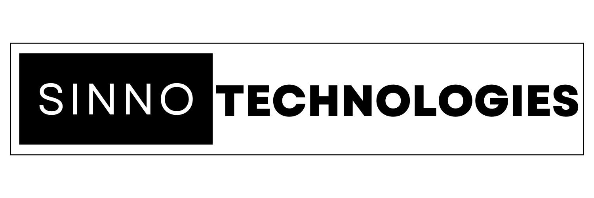

  
  
  
  
  

I am a Full-Stack Software Developer with expertise in building both mobile and web applications. My career vision is centered around promoting accessibility and representation in the technology industry through education and advocacy.

I was born in Kuwait to Lebanese parents. We made the move to Halifax in 2004. Growing up as an immigrant in Canada has given me valuable experiences and a unique perspective that drives me to advocate for others who share similar backgrounds. With a background in Chemical and Industrial Engineering from Dalhousie University and a genuine passion for coding, I am determined to utilize my skills to make a positive impact in the tech world. I firmly believe that everyone, regardless of their background, should have opportunities in the ever-expanding field of technology.

When I'm not immersed in code, I find joy in exploring various hobbies. I'm currently learning to play the drums and keyboard, pushing myself in weightlifting sessions, experimenting with new recipes in the kitchen, diving into captivating books, and sharing snippets of my life through social media. And of course, I can't forget to mention my two beloved cats, Ed and Al, who often steal the spotlight on my <a class="link" href="https://twitter.com/JamilSinno" target="_blank" rel="noreferrer noopener">Twitter</a> feed with their adorable pictures.

Want to know more about me or have a website or app developed for you? Visit me at my <a href="https://jamilsinno.ca">website.</a>

<h3 align="left">Connect with me:</h3>

<h3 align="left">Languages and Tools:</h3>

             

<h1 align="center">Projects</h1>
<table bordercolor="#66b2b2">
  <tr>
    <td width="50%" valign="top">
      <h3 align="center">UNUM Health</h3>
         
        
         
        
 
          Healthcare - No repo or website available.
        

        
Start up - Full Stack Application built with React, PHP, and PostgreSQL in Docker environment. Contract complete. 

    </td>
    <td width="50%" valign="top">
      <h3 align="center">No Game Left Behind</h3>
         
        
         
        
 
          
        

        
HTML, CSS, JavaScript, EJS, Node.js, Express, Passport.js, Tailwind CSS, Daisy UI, MongoDB

    </td>
  </tr>
  
  <tr>
    <td width="50%" valign="top">
      <h3 align="center">R.A.M.P. Atlantic Ltd.</h3>
         
        
         
        
 
          
        

        
HTML, CSS and JS - A website design to showcase R.A.M.P. Atlantic Ltd. website and services.

    </td>
    <td width="50%" valign="top">
      <h3 align="center">Connect the Dots Marketing and Branding</h3>
         
        
         
        
 
          
        

        
HTML, CSS and JS - A website design to showcase Connect The Dots Marketing and Branding's website.

    </td>
  </tr>
  <tr>
    <td width="50%" valign="top">
      <h3 align="center">Canuck Coffee</h3>
         
        
         
        

          
    
  
      

        
HTML, CSS and JS - Canuck coffee is a imaginary coffee shop in the heart of Toronto.

    </td>
    <td width="50%" valign="top">
      <h3 align="center">Steve's Gallery</h3>
         
        
         
        

          
    
  
      

        
HTML, CSS and JS - A website design to showcase Steve Johnson's work from Pexel

    </td>
  </tr>
</table>

<h1 align="center">Decks</h1>
<table bordercolor="#66b2b2">
  <tr>
    <td width="50%" valign="top">
      <h3 align="center">React: A JavaScript Library</h3>
         
        
         
        
 
          
        

        
Technologies used: React.js

        <h6>Tags: Education</h6>
    </td>
    <td width="50%" valign="top">
      <h3 align="center">What Is The Model View Controller? Ft. Mongoose</h3>
         
        
         
        
 
          
        

        
Technologies covered: MVC, Mongoose

        <h6>Tags: Education</h6>
    </td>
  </tr>
  <tr>
    <td width="50%" valign="top">
      <h3 align="center">Travelling App Industrial Engineering Master's Project</h3>
         
        
         
        
 
          
          
        

        
Technologies used: Python, Pyomo, Gurobi

        <h6>Tags: Project, Optimization, Operations Research</h6>
    </td>
  </tr>
</table>
